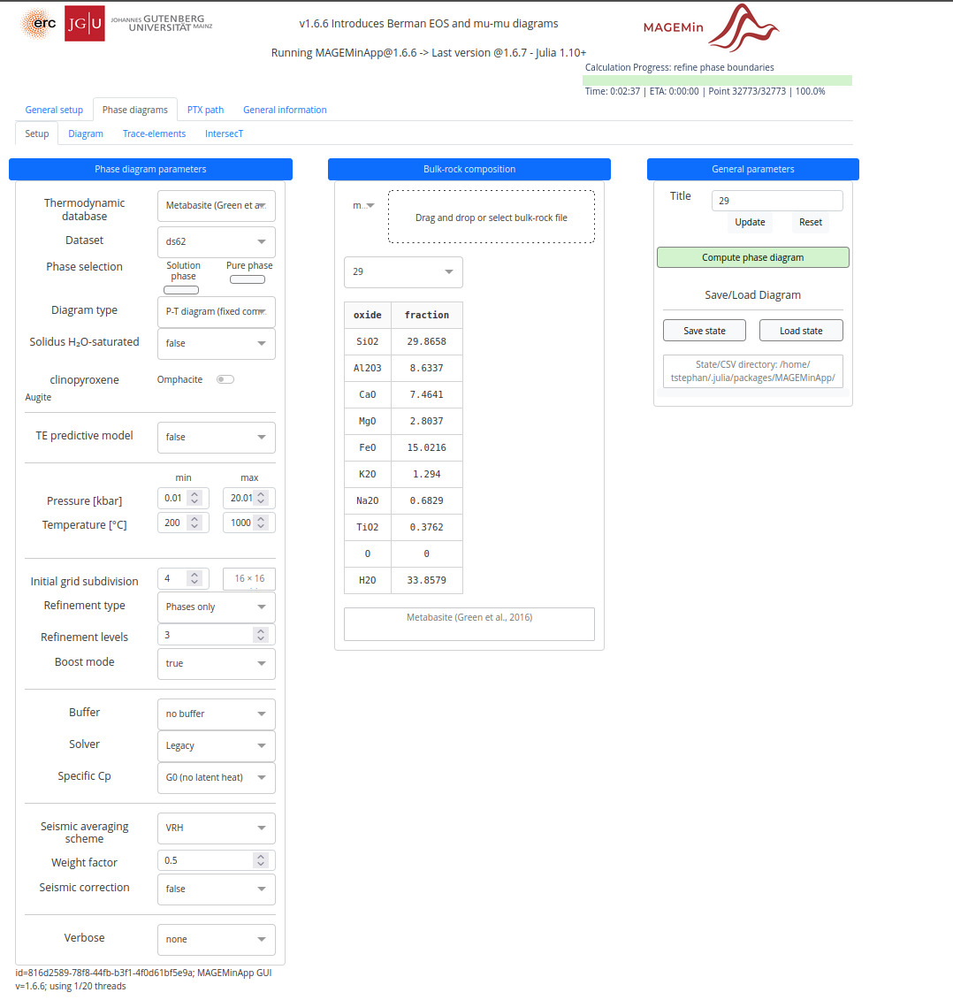
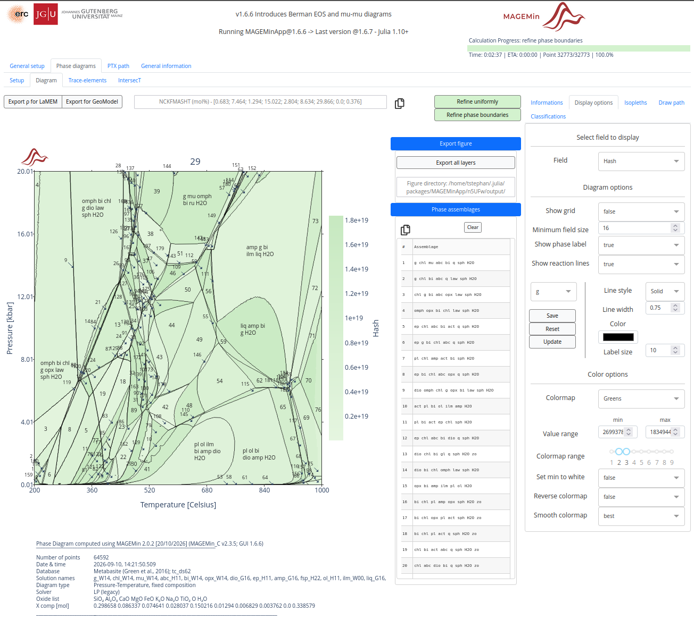
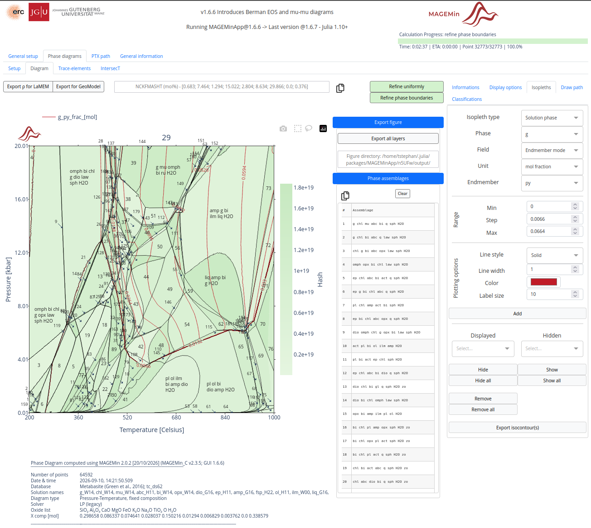

**MAGEMin**[^riel] is a fast, open-source software tool that calculates thermodynamic phase equilibria and pressure-temperature (P-T) pseudosections by minimizing Gibbs free energy for multiphase and multicomponent systems. 

This tutorial explains how you can install the browser-based graphical user interface to MAGEMin (**MAGEMINApp**) and how you can create a pseudosection from bulk-rock geochemical data.

## Installation steps

These steps show how MAGEMinApp can be installed

### 1. Install julia programming language

- Windows: Open the Microsoft Store or run `winget install julia -s msstore` in your command shell.

- macOS and Linux: Run `curl -fsSL https://install.julialang.org | sh` in your terminal.

Verify Installation: Type `julia` in your command-line terminal to start an interactive session.

### 2. Install MAGEMinApp

0.  If not done start a *julia* session in the terminal.

1.  To install packages just type `]` and press enter.

2.  Now install MAGEMinApp by typing `add MAGEMinApp` followed by enter.


## Generate a pseudosection

To run MAGEMinApp, you'll to start julia session. 

```bash
julia
```

<div style="border:1px solid #000; padding: 10px; background-color: #f9f9f9;">
 MAGEMin can utilize multiple CPU of your machine to become even faster. To do that you need to initalize julia with the number of cores indicated with the `-t` flag:

```bash
# To assign a specific number of cores (e.g., 6)
julia -t 6

# Or let Julia automatically utilize all available logical cores
julia -t auto
```
</div>

and then:

```julia
using MAGEMinApp
App()
```

This will initiate the program. After a couple seconds, the following line will appear:

```julia
[ Info: Listening on: 127.0.0.1:8050, thread id: 1
```
You now only need to copy and paste `127.0.0.1:8050` into your browser to launch the App.

### Load a bulk-rock composition

MAGEMinApp is designed is such a way that bulk-rock composition must be entered in a `*.dat` file and loaded in the simulation tab. 
To generate this input file from a classic bulk-rock composition excel file you can use my
[Bulk_to_therin](https://tobiste.shinyapps.io/Bulk_to_therin/) App:

<div style="border:1px solid #000; padding: 10px; background-color: #f9f9f9;">
 **Using *Bulk_to_therin* to generate the input file for MAGEMinApp**
 
1. Upload your excel file in the *THERIN Generator* tab.

2. Switch to the *MAGEMin* tab.

3. Select the desired system by typing the first letters of the elements you want to include in the thermodynamic model: e.g. S for Si, N for Na (exception: Cr and Mn should be spelled Cr and Mn, respectively).

4. If your uploading more than one sample you can filter the data by typing the name of the sample you are interested in into the *Sample* field.

5. Select the database from  the drop-down menu. *mb* stands for *metabasite* and *mp* for *metapelite*. The other acronyms are explained [here](https://github.com/ComputationalThermodynamics/MAGEMinApp.jl#available-thermodynamic-database).

6. Download the file below the *Preview* window on the right.
</div>

Now go back to your MAGEMinApp browser tab and switch to the *Phase Diagrams* tab to open the *Setup* tab. Here you find a drag and drop field in the middle panel where you can upload the *dat* file.

On the left panel you can edit some of the model setup parameters, such as the pressure and temperature range. You can leave all other parameters using the default settings, just **make sure that the correct database is selected**.

Finally, select the sample you want to model below the drag-and-drop field in the middle panel.

### Compute and refine phase diagram

To start the modelling click on the green button (labelled "Compute phase diagram") on the right panel. The computation may take a couple seconds or minutes depending on the power of your computer. Once done, you'll see the generated pseudosection in the *Diagram* tab (opens automatically after the calculation). 




You can now *refine* the field boundaries by hitting the green button labelled "Refine Phase Boundaries". (You can repeat this several times, but the calculation time will increase exponentially with each iteration)

## Modifying colors

By default the phase diagram shows the variance in each mineral assemblage field. You can change the background colors in the *Display options* tab in the right panel. In **Field** you can now choose which parameter you want to show as the diagrams background. 

Choose **Hash** if you want to assign random colors to the each assemblage field. See example below:



## Adding mineral composition isopleths

A mineral composition isopleth is a contour line on a pressure-temperature (P-T) phase diagram or pseudosection that connects points where a specific mineral (usually a solid-solution phase, such as garnet) has a constant chemical composition. 

To add these contour lines in MAGEMinApp switch to the *Isopleths* tab on the right panel. 

- [x] In **Isopleth type** pick *Solution phase*.
- [ ] Pick the **phase** for which the isopleths should be calculated (e.g. g for garnet).
- [ ] Select *Endmember mode* in **Field**.
- [ ] Select *mol fraction* in **Unit**.
- [ ] Pick the endmember of the solid-solution phase (e.g. py for pyrope).
- [ ] Select the plotting parameters of the contour lines (line style, width, color)
- [ ] Hit **Add** to calculate the isopleths and add them to the existing phase diagram.



## Exporting the pseudosection

Click the blue **Export figure** button. MageMinApp exports all layers (background, reaction lines, labels, isopleths, etc.)  as separate SVG files that can be easily opened and stacked using vector graphics editing tools such as Inkscape, where you can further edit the figure to your liking.

[^riel]: Riel, N., Kaus, B. J. P., Green, E. C. R., & Berlie, N. (2022). MAGEMin, an efficient Gibbs energy minimizer: Application to igneous systems. *Geochemistry, Geophysics, Geosystems*, 23, e2022GC010427. doi: [10.1029/2022GC010427](https://doi.org/10.1029/2022GC010427)
