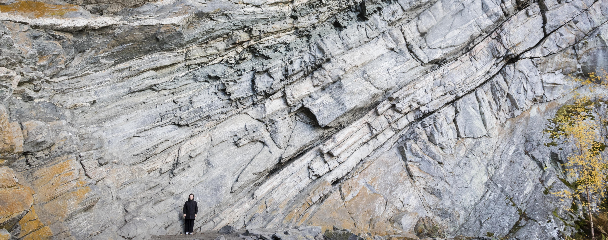
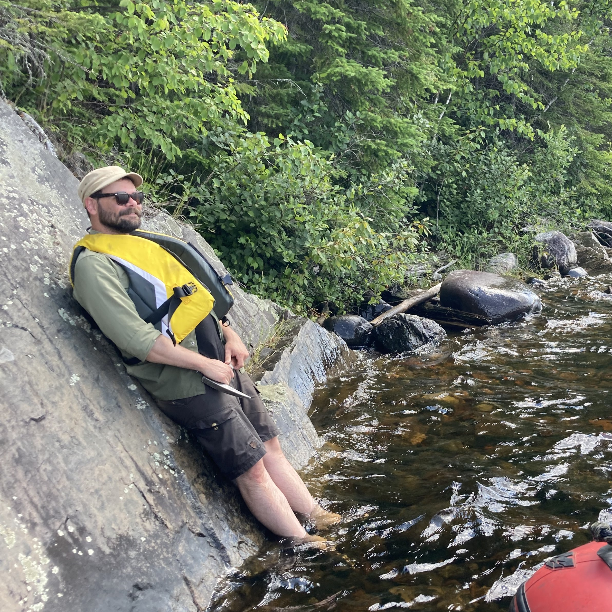
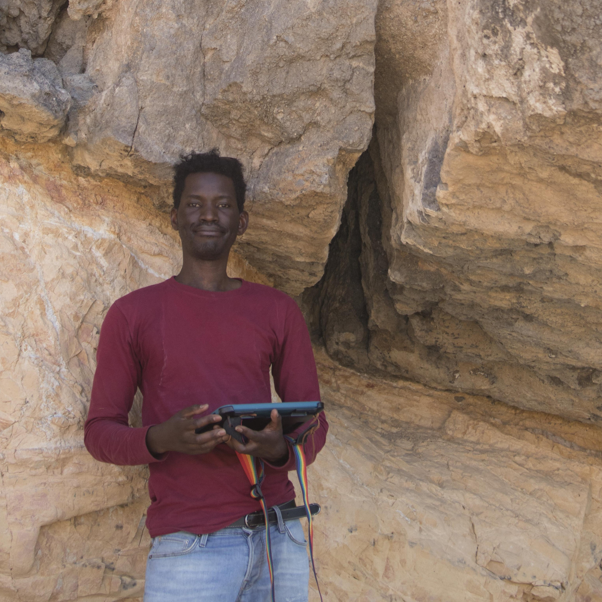
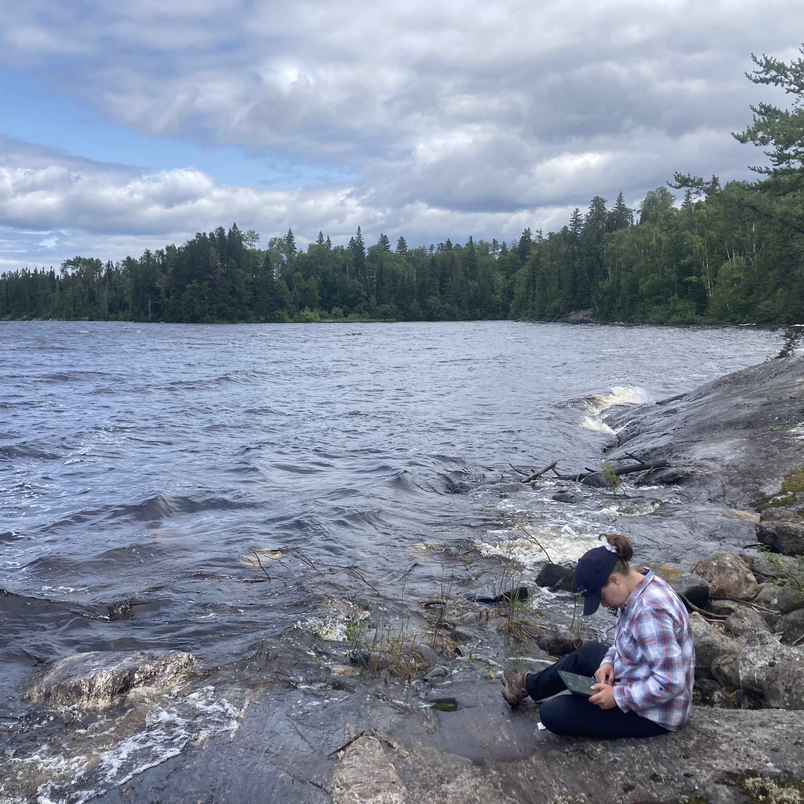

> *Alert! We are currently hiring graduate students! If you are interested in studying structural geology, tectonics and metamorphic petrology, please contact [tstephan\@lakeheadu.ca](tstephan@lakeheadu.ca) and include your CV and transcript.*

::::: grid
::: g-col-3

:::

::: g-col-9
[**Dr. Tobias Stephan**]{style="font-size: 130%;"}

Tobias studies lithospheric stress fields and drivers of intraplate tectonics, deformation and metamorphic conditions during Archean tectonics, deformation-induced permeability for fluid migration, as well as plate-motion in deep time.

[tstephan\@lakeheadu.ca](tstephan@lakeheadu.ca)
:::
:::::

::::: grid
::: g-col-3

:::

::: g-col-9
[**Dr. Moses Angombe**]{style="font-size: 130%;"}

Moses studies how fault mechanics to understand how changes of stress govern fault slip, fluid flow, and the formation of critical metals.

[Moses' personal website](https://mangombe.weebly.com/)

[mangombe\@lakeheadu.ca](mangombe@lakeheadu.ca)
:::
:::::

### Graduate Students

::::: grid
::: g-col-3

:::

::: g-col-9
[**Hanna Tiitto**]{style="font-size: 130%;"}

Hanna studies the kinematics, conditions and timing of the Quetico Shear Zone (Ontario). Hanna is co-supervised by [Dr. Noah Phillips (USC)](https://structuralgeo.github.io/index.html) and me.

[hmtiitto\@lakeheadu.ca](hmtiitto@lakeheadu.ca)
:::
:::::

### Undergraduate Students

::::: grid
::: g-col-3

:::

::: g-col-9
[**Brooke Miller**]{style="font-size: 130%;"}

Brooke studies deformation-induced fluid flow at the White River Gold Mine (ON).
:::
:::::

::::: grid
::: g-col-3
:::

::: g-col-9
[**Logan Pelaia**]{style="font-size: 130%;"}

Logan is working with Moses and studies the 3D structure and deformation gradients of the Triple-J Shear Zone (ON)
:::
:::::
