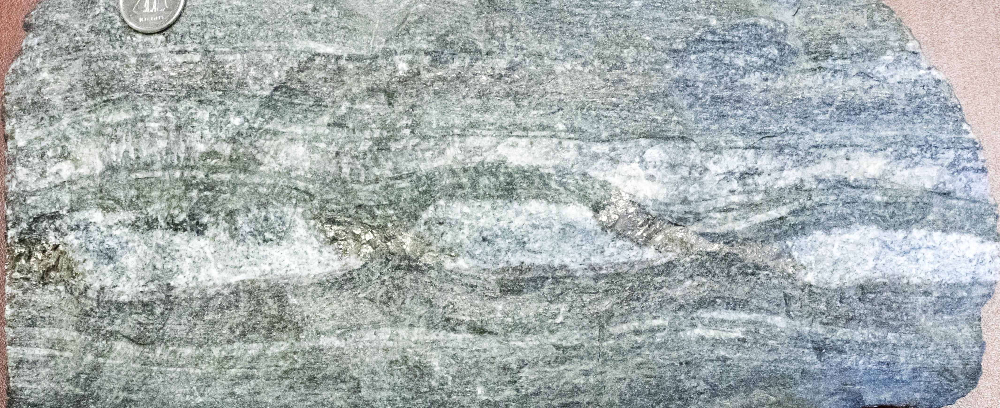
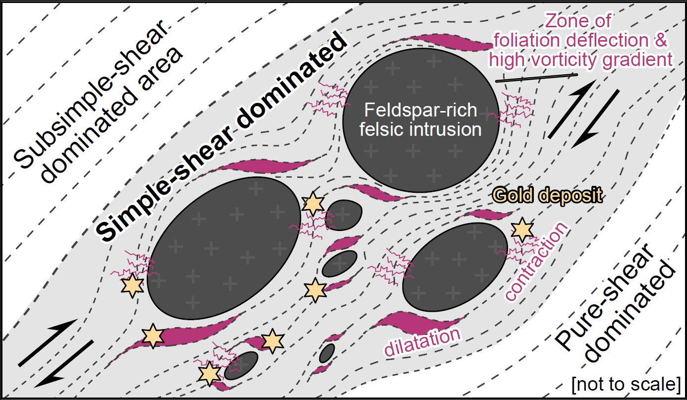
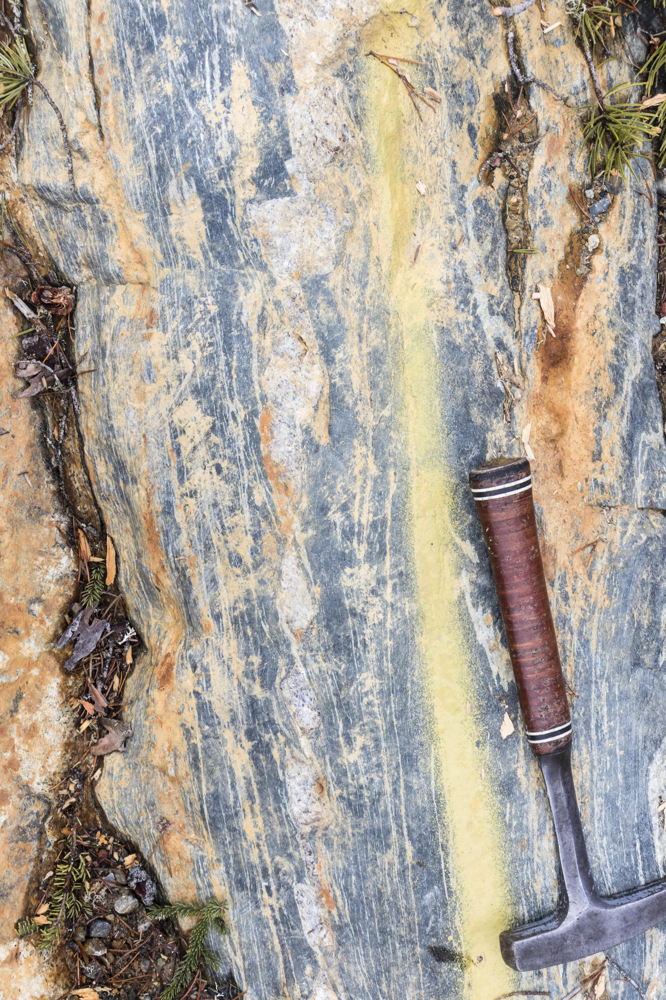
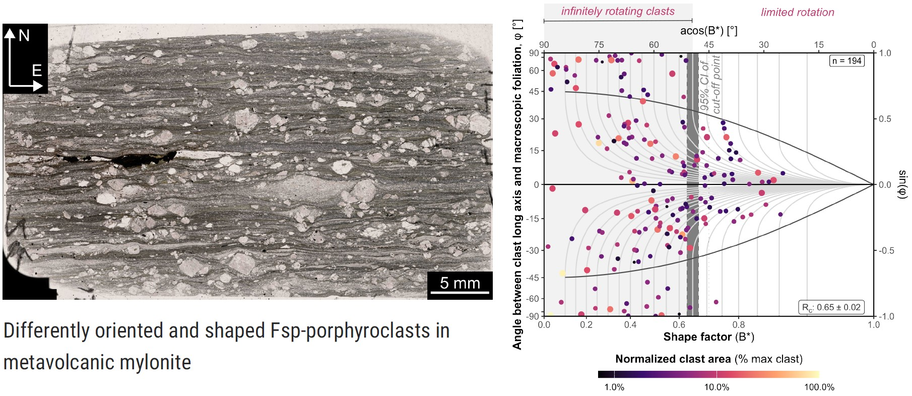
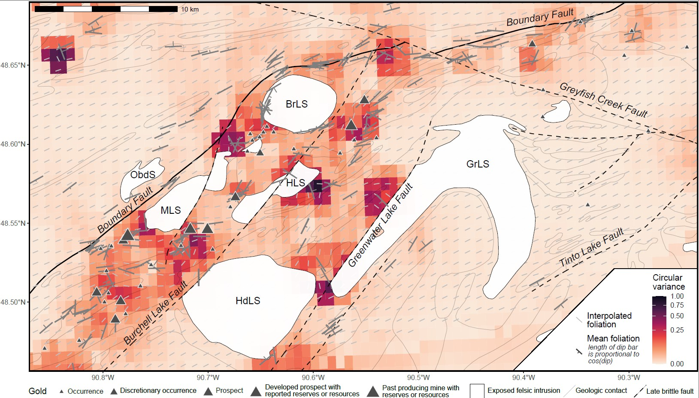

## The structural control of mineral deposits

*Structural control* is the combined effect of rock fabric, deformation, and metamorphic conditions on concentrating and localizing metals within the crust. This includes how fabric orientation, kinematics, and topology, including fracture or fault networks, govern fluid flow pathways and sites of mineral precipitation, and how deformation conditions, such as strain geometry, vorticity, deviatoric stress, and deformation rates, collectively control the evolution of permeability and the redistribution (remobilization) of material during both brittle and ductile processes. 
At the same time, metamorphic parameters (pressure, temperature, and fluid composition) regulate metal solubility, transport, and precipitation. Structural control therefore encompasses both the spatial localization of mineralization and its genetic evolution, whether formed during a single event or through multiple deformation and remobilization cycles. 
Predicting the location of gold mineralization thus requires a holistic understanding of the interplay between deformation, metamorphism, alteration, and fluid flow.

## Hypothesis testing

Fluids flow along a pressure (stress) gradient. For fluids to flow in the deep crust, deformation is required produce permeability. 
In @Stephan2025a, we suggest that large igneous bodies act as rigid competent bodies during deformation in Archean granite-greenstone belts, causing strain partitioning in surrounding metavolcanic rocks. Depending on the stress field orientation, strain partitioning creates localized sites with contraction (higher mean stress) and dilation (lower mean stress). This provides a testable mechanism linking lithological heterogeneity, deformation, and fluid flow to gold localization.

## Our integrated approach

::: {.grid}
::: {.g-col-5}

:::

::: {.g-col-6}
We use a integrated approach of these tools:

-   **Field work** to measure orientation and kinematics of the deformation

-   Microstructural analysis and Electron backscatter diffraction (EBSD) to constrain deformation conditions

-   Vorticity analysis to constrain the geometry of strain

-   Geochemistry and metamorphic petrology (conventional geothermobarometry and thermodynamic modelling) to constrain ambient pressures, temperatures and the fluid composition

-   Geochronology (Re-Os molybdenite, U-Pb zircon/titanite/apatite/monazite) to constrain timing and rates of deformation

-   **Geostatistics** to identify spatial correlations of these constraints
:::

:::

